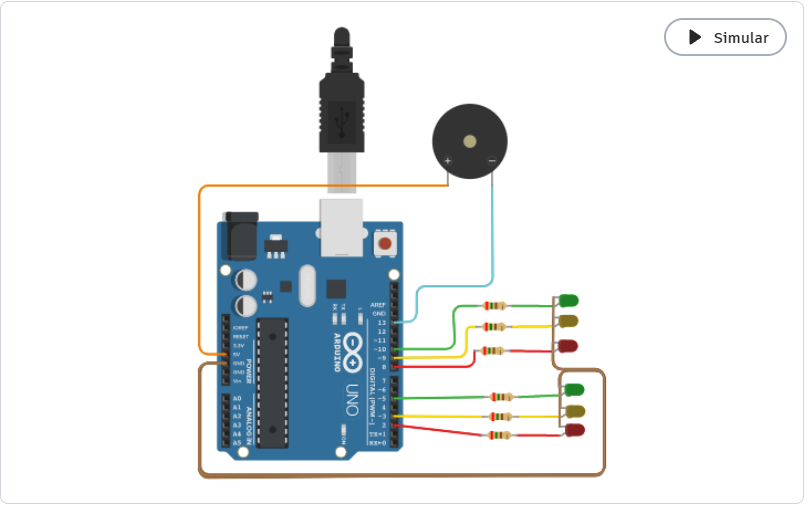

# Ejemplo Documentación Dojos

## Integrantes 
- Ivan Gonzalez, Emanuel Diaz, Leando Dominguez, Nahuel Gallardo

## Proyecto: Semaforo para sordos.

## Descripción
Un semaforo que hace un ruido fuerte al estar en rojo.

## Función principal
Esta funcion se encarga de encender y apagar los leds en orden de semaforo emitiendo un ruido cuando esta en rojo.

tiempo_verde y tiempo_amarillo son int que tienen el dato de cuanto tiempo de delay va a tener la secuecia llamada.

Los parametros de secuencia_rojo_sonido son el tiempo por cuanto dura el sonido y por cuanto corta. Estos se repite 10 veces.

~~~ C (lenguaje en el que esta escrito)
void secuencia()
{
  
  secuencia_verde(tiempo_verde);
  secuencia_amarilla(tiempo_amarillo);
  secuencia_rojo_sonido(250, 250);
  
}
~~~

## :robot: Link al proyecto
- [proyecto](https://www.tinkercad.com/things/kuVxSfXPISz?sharecode=K9BxnWGeQkrqQvVaxeRv2UcdXNd89HusIHRD_L90xJA)

---
### Fuentes
- [Consejos para documentar](https://www.sohamkamani.com/how-to-write-good-documentation/#architecture-documentation).

- [Lenguaje Markdown](https://markdown.es/sintaxis-markdown/#linkauto).

- [Markdown Cheatsheet](https://github.com/adam-p/markdown-here/wiki/Markdown-Cheatsheet).

- [Tutorial](https://www.youtube.com/watch?v=oxaH9CFpeEE).

- [Emojis](https://gist.github.com/rxaviers/7360908).
